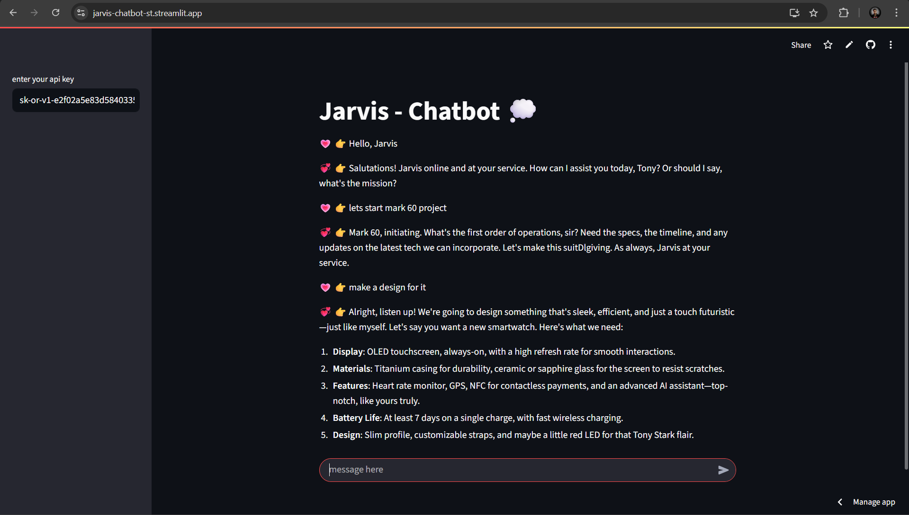

# 🤖 Jarvis Chatbot (Streamlit)

A simple and fun **chatbot app** built with [Streamlit](https://streamlit.io/) and the [OpenRouter API](https://openrouter.ai/).  
Inspired by **Jarvis from Iron Man**, the bot responds in a short, cool, and human-like way.  

👉 Live Demo: [jarvis-chatbot-st.streamlit.app](https://jarvis-chatbot-st.streamlit.app/)

---

## ✨ Features
- 🎭 **Jarvis-like personality** – short, witty, and fun answers
- 🔑 **User-provided API key** – you bring your own OpenRouter key (safe, no hardcoded keys)
- 🖥️ **Minimal & clean UI** – chat interface powered by Streamlit
- 🚀 **Deployable anywhere** – easily run locally or host on [Streamlit Cloud](https://streamlit.io/cloud)

---

## 🛠️ How it Works
1. User enters their **OpenRouter API key** in the sidebar (left panel).
2. Type a message in the chat box.
3. Jarvis replies instantly, giving you that **Iron Man vibe**. ⚡

---

## 🔑 Getting an OpenRouter API Key
1. Go to [OpenRouter.ai](https://openrouter.ai/).  
2. Sign up and navigate to your **API Keys** section.  
3. Copy your API key (looks like `sk-xxxx...`).  
4. Paste it into the sidebar of this app.

---

## 📦 Installation & Local Setup

Clone the repo:

```bash
git clone https://github.com/your-username/jarvis-chatbot.git
cd jarvis-chatbot

Create a virtual environment and install dependencies:

pip install -r requirements.txt


Run the app:

streamlit run app.py

🌍 Deployment

This app is deployed on Streamlit Cloud:
👉 https://jarvis-chatbot-st.streamlit.app/

To deploy your own:

Push your repo to GitHub.

Go to Streamlit Cloud.

Create a new app and link your GitHub repo.

Done 🎉

📷 Screenshots

Main Chat Interface

Landing Page


Enter api_key


Enter Jarvis is ready


📜 Requirements

Python 3.9+

Streamlit

Requests

An OpenRouter
 API key

⚠️ Notes

Your API key is never stored — it stays in your session only.

Free-tier OpenRouter models may have usage limits.

This app is for learning & fun purposes.

💡 Future In App

Add conversation history memory using st.session_state


Support for one model - mistralai/mistral-small-3.1-24b-instruct:free

Dark/light mode toggle according to your system

Downloadable chat transcripts

🙌 Acknowledgments

Inspired by Iron Man’s Jarvis 🦾

Streamlit
 for the amazing framework

OpenRouter
 for easy access to multiple LLMs

```
